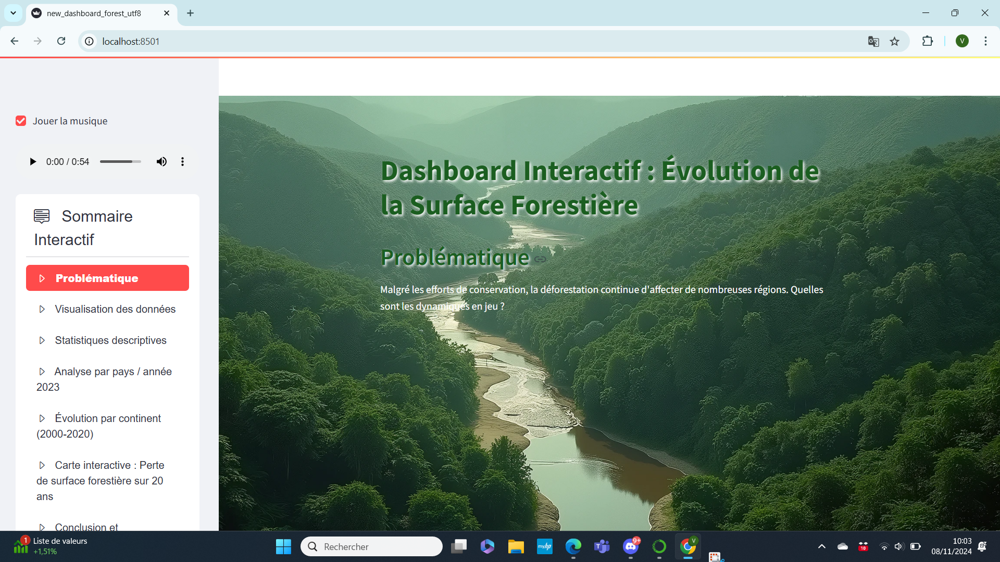

# Rapport de Tests de Compatibilité

## Tests de Compatibilité entre Navigateurs

Dans cette section, nous présentons les résultats des tests effectués sur notre application à travers différents navigateurs. Chaque capture d'écran est accompagnée d'une description des résultats observés.

### 1. Test sur Google Chrome

**Description :**  
Cette capture d'écran montre l'affichage de l'application dans Google Chrome. La disposition des éléments est conforme aux attentes, et toutes les fonctionnalités sont accessibles.

- **Résultat :** Affichage correct et interactif.
- **Commentaires :** Aucun problème majeur détecté.

---

### 2. Test sur Microsoft Edge

**Description :**  
La capture d'écran illustre l'application telle qu'elle apparaît dans Microsoft Edge. Tous les éléments sont bien alignés et fonctionnent correctement.

- **Résultat :** Affichage correct.
- **Commentaires :** aucun problème détecté 

---

### 3. Test sur Firefox

**Description :**  
Cette capture d'écran montre l'affichage de l'application dans Firefox. La présentation est cohérente avec celle des autres navigateurs, et l'interaction fonctionne sans problèmes.

- **Résultat :** Affichage correct.
- **Commentaires :** Pas d'anomalies constatées.

---

## Conclusion des Tests

Tous les navigateurs testés (Google Chrome, Microsoft Edge, et Firefox) ont affiché l'application sans problèmes majeurs. Des vérifications supplémentaires sur Safari sont nécessaires pour garantir la compatibilité.

### Tests de l'application sur téléphone mobile

Afin de vérifier la compatibilité de l'application mobile, nous avons effectué des tests sur plusieurs appareils pour observer le rendu de l'application sur différentes tailles d'écran.

### Test sur Galaxy Note

Voici la capture d'écran de l'application testée sur un **Samsung Galaxy Note** :

### Test sur iPad Air

Voici la capture d'écran de l'application testée sur un **iPad Air** :

### Test sur iPhone 14 Pro Max

Voici la capture d'écran de l'application testée sur un **iPhone 14 Pro Max** :

Ces tests montrent que l'application s'adapte bien aux différentes tailles d'écran, assurant ainsi une expérience utilisateur fluide sur mobile.
