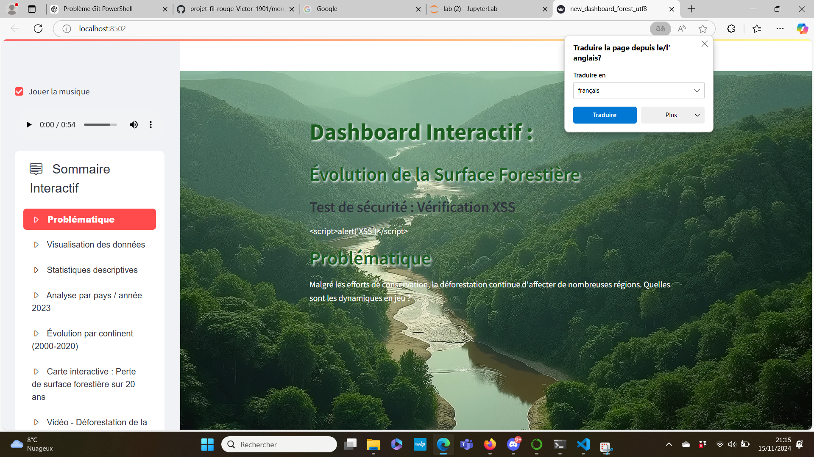

# Rapport de test de sécurité : Vérification XSS

## Description :
Dans ce test, nous avons injecté du code JavaScript malveillant pour vérifier si l'application est vulnérable aux attaques **XSS** (Cross-Site Scripting). L'objectif était de tester si l'application exécuterait un script malveillant ou si ce dernier serait correctement échappé et affiché comme du texte.

## Résultat :
Le script malveillant a été affiché comme du texte brut, ce qui montre que l'application protège correctement contre les attaques XSS. Aucun script n'a été exécuté.

## Capture d'écran :
Voici la capture d'écran du résultat du test XSS dans l'application. Le code malveillant est affiché en texte brut, ce qui montre que l'application a bien filtré le code.

### Pourquoi aucun autre test n'a été réalisé :

Les tests de sécurité supplémentaires tels que l'injection SQL, les attaques CSRF, ou encore les tests de gestion des mots de passe n'ont pas été effectués pour les raisons suivantes :

Pas de base de données : L'application ne se connecte pas à une base de données, donc il n'y a pas de point d'entrée permettant des attaques par injection SQL. De plus, il n'y a pas de formulaires de soumission de données susceptibles d'être exploités via une injection de SQL.

Pas de champs de saisie utilisateurs : L'application ne contient pas de champs de formulaire permettant aux utilisateurs d'entrer des données. Par conséquent, il n'y a pas de risques d'injection XSS ou d'attaque CSRF dans la mesure où aucune donnée sensible n'est transmise ou traitée via un formulaire.

Pas de gestion des mots de passe : Il n'y a pas de gestion d'authentification ou de connexion utilisateur, ce qui élimine la possibilité de tests de sécurité comme les attaques sur les mots de passe ou les mécanismes de sécurité liés à l'authentification.

Ainsi, étant donné la nature de l'application et son fonctionnement, les tests de sécurité sont principalement axés sur la protection contre les attaques XSS, ce qui a été vérifié avec succès. D'autres tests de sécurité, tels que ceux mentionnés ci-dessus, ne sont pas pertinents dans ce contexte.