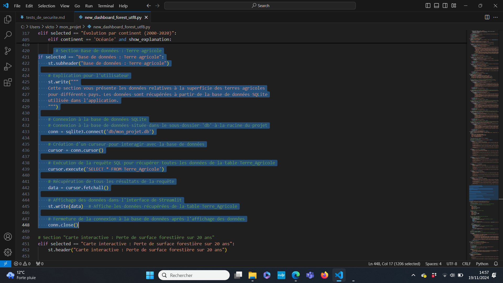
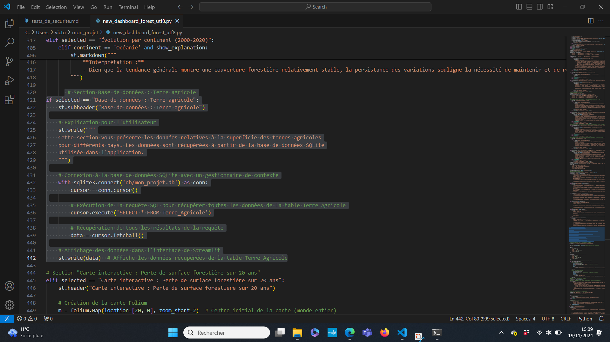

# Rapport de test de sécurité : Vérification XSS

## Description :
Dans ce test, nous avons injecté du code JavaScript malveillant pour vérifier si l'application est vulnérable aux attaques **XSS** (Cross-Site Scripting). L'objectif était de tester si l'application exécuterait un script malveillant ou si ce dernier serait correctement échappé et affiché comme du texte.

## Résultat :
Le script malveillant a été affiché comme du texte brut, ce qui montre que l'application protège correctement contre les attaques XSS. Aucun script n'a été exécuté.

## Capture d'écran :
Voici la capture d'écran du résultat du test XSS dans l'application. Le code malveillant est affiché en texte brut, ce qui montre que l'application a bien filtré le code.


### Pourquoi aucun autre test n'a été réalisé dans un premier temps 

Les tests de sécurité supplémentaires tels que l'injection SQL, les attaques CSRF, ou encore les tests de gestion des mots de passe n'ont pas été effectués pour les raisons suivantes :

Pas de base de données : L'application ne se connecte pas à une base de données, donc il n'y a pas de point d'entrée permettant des attaques par injection SQL. De plus, il n'y a pas de formulaires de soumission de données susceptibles d'être exploités via une injection de SQL.

Pas de champs de saisie utilisateurs : L'application ne contient pas de champs de formulaire permettant aux utilisateurs d'entrer des données. Par conséquent, il n'y a pas de risques d'injection XSS ou d'attaque CSRF dans la mesure où aucune donnée sensible n'est transmise ou traitée via un formulaire.

Pas de gestion des mots de passe : Il n'y a pas de gestion d'authentification ou de connexion utilisateur, ce qui élimine la possibilité de tests de sécurité comme les attaques sur les mots de passe ou les mécanismes de sécurité liés à l'authentification.

Ainsi, étant donné la nature de l'application et son fonctionnement, les tests de sécurité sont principalement axés sur la protection contre les attaques XSS, ce qui a été vérifié avec succès. D'autres tests de sécurité, tels que ceux mentionnés ci-dessus, ne sont pas pertinents dans ce contexte.


# Rapport de Sécurisation : Protection contre l'Injection SQL ( depuis implantation Base de données dans l'application)

## Introduction

Dans le cadre de la sécurisation de notre application, nous avons identifié une vulnérabilité liée à l'utilisation d'une connexion à la base de données sans gestion appropriée des ressources. Cela pouvait potentiellement mener à des problèmes de sécurité, tels que des injections SQL ou des connexions non fermées, affectant la performance de l'application. Ce rapport présente le code avant et après l'implémentation de mesures de sécurité.

## Capture d'écran : Code Non Sécurisé



Dans cette version initiale du code, la connexion à la base de données était effectuée sans l'utilisation d'un gestionnaire de contexte. Cela présentait des risques liés à la fermeture incorrecte de la connexion, surtout en cas d'erreur, pouvant conduire à des fuites de ressources et à des problèmes de stabilité pour l'application.

Le code se présentait comme suit :

- Connexion directe avec `sqlite3.connect('db/mon_projet.db')`.
- Utilisation d'un curseur (`cursor`) sans garantie de fermeture de la connexion en cas d'erreur.
- Aucune gestion automatique des ressources, ce qui pouvait entraîner des problèmes dans le cas où plusieurs connexions étaient ouvertes.

## Capture d'écran : Code Sécurisé



La version améliorée du code utilise un **gestionnaire de contexte** (`with`) pour assurer une gestion sûre et appropriée des connexions à la base de données.

### Changements Apportés :

1. **Utilisation d'un Gestionnaire de Contexte (`with`)** :
   - Le code amélioré utilise `with sqlite3.connect('db/mon_projet.db') as conn:` pour garantir que la connexion à la base de données est correctement fermée, même en cas d'exception.
   - Cela permet d'éviter des problèmes liés à des connexions laissées ouvertes et contribue à rendre le code plus robuste.

2. **Amélioration de la Lisibilité et de la Maintenance** :
   - En utilisant le gestionnaire de contexte, le code devient plus lisible et concis.
   - La fermeture automatique des connexions à la base de données améliore la maintenabilité du projet et réduit le risque d'erreurs.

3. **Protection contre les Risques de Sécurité** :
   - Bien que l'injection SQL soit peu probable dans ce cas, l'utilisation de `with` améliore globalement la gestion des connexions et prépare le projet à être plus sûr, évitant ainsi des erreurs imprévues.

### Code Modifié :
Voici le code amélioré qui a été présenté dans la capture d'écran « Code Sécurisé » :

```python
import streamlit as st
import sqlite3

# Section Base de données : Terre agricole
if selected == "Base de données : Terre agricole":
    st.subheader("Base de données : Terre agricole")

    # Explication pour l'utilisateur
    st.write("""
    Cette section vous présente les données relatives à la superficie des terres agricoles
    pour différents pays. Les données sont récupérées à partir de la base de données SQLite
    utilisée dans l'application.
    """)

    # Connexion à la base de données SQLite avec un gestionnaire de contexte
    with sqlite3.connect('db/mon_projet.db') as conn:
        cursor = conn.cursor()

        # Exécution de la requête SQL pour récupérer toutes les données de la table Terre_Agricole
        cursor.execute('SELECT * FROM Terre_Agricole')

        # Récupération de tous les résultats de la requête
        data = cursor.fetchall()

    # Affichage des données dans l'interface de Streamlit
    st.write(data)  # Affiche les données récupérées de la table Terre_Agricole
```

## Conclusion

L'amélioration apportée à ce code montre l'importance de la gestion des ressources pour garantir la sécurité et la stabilité de l'application. L'utilisation de gestionnaires de contexte permet d'assurer la bonne fermeture des connexions, réduisant ainsi le risque de fuites de ressources. Ces ajustements rendent le code non seulement plus sécurisé, mais également plus lisible et maintenable.

Ces bonnes pratiques doivent être appliquées systématiquement pour améliorer la qualité globale de votre application.
